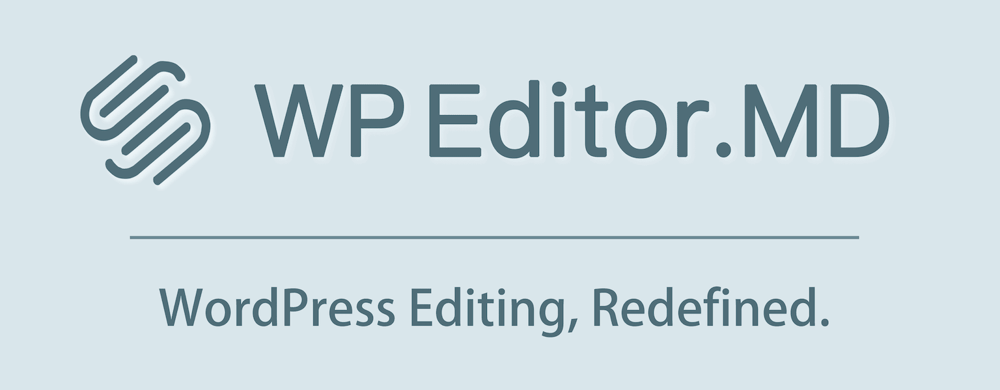

# Home | 首页 | 主頁

---

## 欢迎使用

感谢您选择WP Editor.md！

本插件不仅能提供WordPress下所见即所得的Markdown编辑体验，更能为您的站点增加LaTeX公式编辑、Mermaid图表绘制、Prism代码高亮等多项功能。

无论您是Markdown新手还是高手，本插件都能为你带来与众不同的Markdown撰写体验！

请点击侧边栏中的[Documentation (简体中文)](/Documentation%20%28简体中文%29/) 继续阅读相关文档和使用手册！

---

## 歡迎使用

感謝您選擇WP Editor.md！

這是一款WordPress下所見即所得的Markdown編輯器，更是一款能支援LaTeX公式編輯、Mermaid圖表繪製、Prism程式碼高亮等多種功能的編輯器！

無論您是Markdown菜鳥還是老手，WP Editor.md都是為您量身訂做的不二之選！

點擊側邊的[Documentation (正體|繁體)](/Documentation%20%28正體%7C繁體%29/) 繼續閱讀相關文檔和使用手冊！

---

## Welcome

Thank you for choosing WP Editor.md. 

This plugin can not only provide WYSIWYG capability in WordPress, but also many other handy features like LaTeX display, Mermaid diagram, Prism code higighting and more! 

Whether you are new to Markdown or a master, this plugin is just made for you! 

Click the [Documentation (English)](/Documentation%20%28English%29) from side panel to know more about WP Editor.md!
